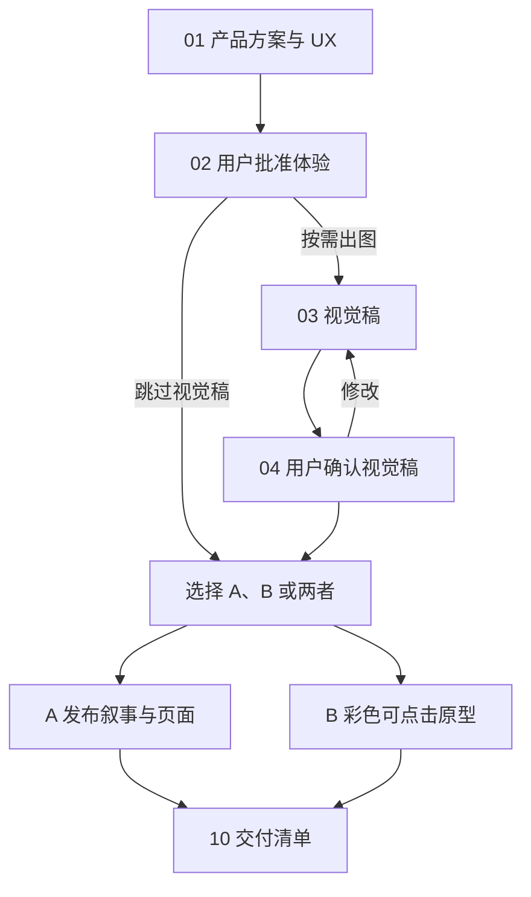

# 产品发布叙事与讲解词工作流使用说明书

这套工作流从产品体验出发，按需要交付**发布会页面（A）**、**彩色可点击原型（B）**，或同时交付两者。用户只需在关键节点给出要求、选择方向和批准版本；文件名在草稿、修改、批准阶段保持不变。

## 开始前：选择要做什么

| 你需要决定 | 可提供的信息 |
| --- | --- |
| 产品要解决什么问题 | 目标用户、场景、现有痛点、目标设备；已有方案或截图可一并提供 |
| 本次交付到哪一步 | 只要文字方案、还要 UX 视觉稿、走发布会路径 A、走原型路径 B，或两条都走 |
| 有哪些已定边界 | 已批准的版本、必须保留或排除的功能、指定素材和不能宣称的能力 |

工作流所用的 skill 如下。两项**个人 skill**需在使用前安装到账号；表中的 GitHub 链接可查看其源码。

| skill | 类型 | 何时调用 |
| --- | --- | --- |
| `@Product Design` | GPT 自带 skill | 定义产品与 UX 流程；制作彩色可点击原型 |
| 鸿蒙 UX 默认规范 [`@apply-harmonyos-ux-defaults`](https://github.com/lwyjames/harmonyos-ux-defaults) | 个人 skill | 涉及 HarmonyOS 设备与系统界面时一起调用 |
| `@创建图像` | GPT 自带 skill | 制作 UX 视觉稿或发布会图片 |
| [产品发布叙事与讲解词](https://github.com/lwyjames/craft-product-keynote-narrative) `@craft-product-keynote-narrative` | 个人 skill | 写发布叙事、逐页文案和中文讲解词 |
| `@Presentations` | GPT 自带 skill | 制作或修改发布会幻灯片 |

## 工作流总览

### 01–02 确认产品体验

**你决定：** 问题、设备与范围；收到方案后，指出取舍并明确批准当前 UX 版本。

> `@Product Design @apply-harmonyos-ux-defaults 请为[用户]在[场景]中的[问题]设计[功能]。目标设备是[机型与屏幕状态]。先只写文字，将产品方案与完整 UX 流程保存为产品方案与UX流程.md，标出未确认的能力；暂不出图。`

收到 `产品方案与UX流程.md`（待审批）后，可提出修改；确认时明确说：

> `我批准当前产品方案与UX流程.md 作为后续制作的 UX 基线。[未确认能力]暂不纳入。`

**交接：** `产品方案与UX流程.md`（批准版）进入 03，或直接进入 A/B。提出修改意见本身不等于批准。

### 03–04 按需确认 UX 视觉稿

**你决定：** 是否需要出图、先做哪些页面、每一轮是否继续。常用顺序为**黑白轻量预览稿 → 彩色轻量预览稿 → 按需原生尺寸版本**；三类都是 PNG，分别确认。

> `@创建图像 @apply-harmonyos-ux-defaults 请按已批准的产品方案与UX流程.md，为[页面ID]先生成黑白轻量预览稿。设备为[机型与方向]，使用已批准的参考图。暂不生成彩色或原生尺寸版本。`

审阅后可以说：

> `UX视觉稿_01_黑白轻量预览稿.png 的布局已确认。请保持结构，继续生成彩色轻量预览稿；原生尺寸版本稍后再做。`

**交接：** 仅把你确认的 PNG 和批准版 UX 文件交给 A/B。若不需要图，可跳过 03–04；制作原型前仍需确定视觉目标。

## 路径 A：发布会页面（05A–08A）

### 05A–06A 给出发布要求，批准叙事稿

**你决定：** 面向谁、讲几页、总时长、重点讲什么、不能讲什么。发布要求由用户给出；skill 产出 `发布叙事.md`，包括逐页标题、屏幕文案、演示动作和中文讲解词。

> `@craft-product-keynote-narrative 请基于批准版产品方案与UX流程.md 和获批视觉稿，制作面向[观众]的[页数]页发布叙事，总时长[时长]。重点讲[价值]，不要宣称[未确认能力]。交付发布叙事.md 草稿供我审阅。`

需要修改时指出页码和要求；确认时明确说：

> `我批准当前修订的发布叙事.md，请以它为准制作页面。`

**交接：** `发布叙事.md`（批准版）进入 07A。只有你明确批准当前修订，才标为批准版；改稿后需重新确认。

### 07A–08A 制作并审阅页面

**你决定：** PPT 或单页 PNG、画幅、要沿用的风格与素材；审阅后指出需修改的页面，或批准交付。

> `@Presentations 请按批准版发布叙事.md 制作 16:9 发布会幻灯片.pptx，使用获批 UX 图。第[页]另交发布会页面_<页码>.png。`

若需要新的插画，可单独调用 `@创建图像`。页面交付后核对主张、画面和口播；局部修改可只指出受影响的页。

**交接：** 获批的 `发布会幻灯片.pptx`、按需 PNG 和 `发布叙事.md` 进入 10。若只制作 PNG，就只交实际产生的图片。

## 路径 B：彩色可点击原型（05B–09B）

### 05B–07B 定义范围并试用预览

**你决定：** 要演示哪些点击路径与状态、目标设备，以及 Windows 离线包应如何启动。原型一律使用彩色 UX。若未提供获批视觉稿，先选择视觉方向再制作。

> `@Product Design @apply-harmonyos-ux-defaults 请按批准版产品方案与UX流程.md 和选定视觉稿制作彩色可点击原型。覆盖[起点、关键操作、取消或返回、完成状态]。先交网页预览供我试用，最终交 Windows 离线 ZIP。`

试用时，用“从哪里点、实际发生什么、预期是什么”反馈问题。例如：

> `从[状态]点击[按钮]后出现[实际结果]，预期是[状态]。请修复并保持其他已确认页面。`

### 08B–09B 打包并验收最终 ZIP

**你决定：** 预览问题是否已解决，以及最终离线包是否通过验收。

> `@Product Design 请修复反馈，将原型和本地资源打包为可点击原型_Windows离线.zip，附启动说明，并从最终 ZIP 解压后检查启动与主要点击路径。`

拿到 ZIP 后，在**新目录解压**，按说明启动并走完主要流程。若双击 `index.html` 无法完整运行，应使用包内提供的本地启动器。可将失败路径和现象发回 08B 重打同名 ZIP。若尚未在 Windows 实机检查，交付记录须写明“Windows 实机未验证”。

**交接：** 通过验收的 `可点击原型_Windows离线.zip`、启动说明及验收结论进入 10。

## 10 整理交付

> `请把本次实际产生且已确认的文件整理为交付清单.md，列出文件链接、修订、批准或验收状态，以及尚未完成的验证。`

| 文件 | 何时会有 |
| --- | --- |
| `产品方案与UX流程.md` | 完成 01–02 后；同名文件从待审批变为批准版 |
| `UX视觉稿_<页面ID>_黑白轻量预览稿.png`、`UX视觉稿_<页面ID>_彩色轻量预览稿.png`、按需 `UX视觉稿_<页面ID>_原生尺寸版本.png` | 走 03–04 时；各阶段为不同 PNG |
| `发布叙事.md`、`发布会幻灯片.pptx`、按需 `发布会插画_<页码>.png`／`发布会页面_<页码>.png` | 走 A 时，按实际制作内容列出 |
| `可点击原型源码/`、`可点击原型_Windows离线.zip` | 走 B 时；ZIP 标明解压和 Windows 验证结果 |
| `交付清单.md` | 最终汇总，只列本次实际产生的文件 |

草稿、批准版、待验收等**是文件状态，不追加到文件名**。审批和返修意见留在对话中；每次改动只返回受影响的步骤，若改动了上游已批准的产品能力或发布主张，再重新确认对应基线。
