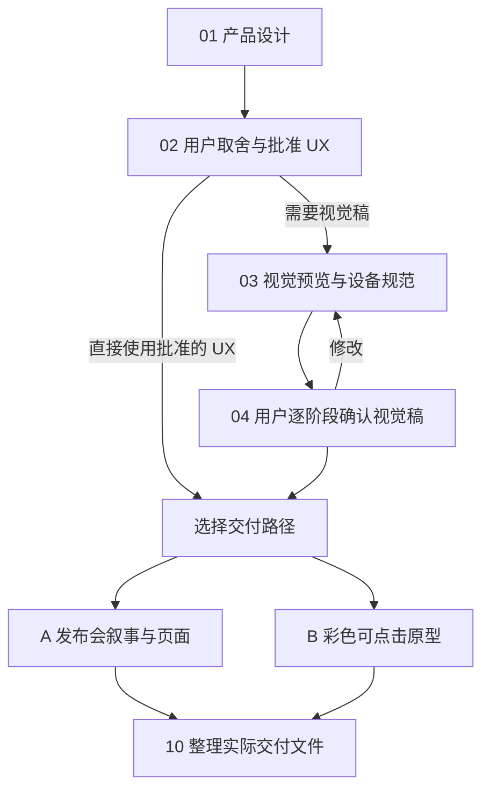
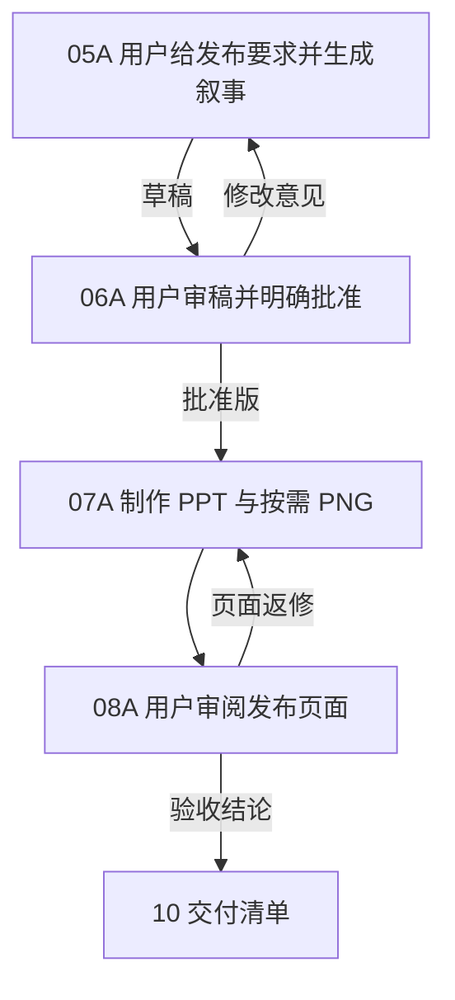
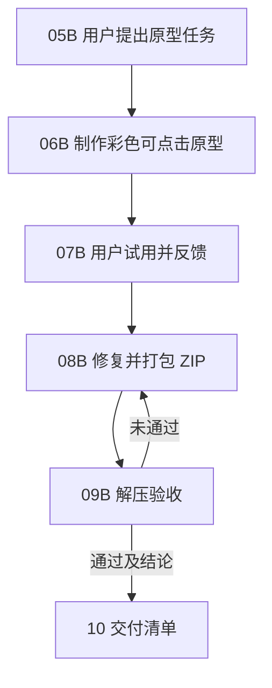

# 产品发布叙事与讲解词工作流及 skill 使用说明书

本说明书面向第一次参与产品发布内容制作的同事。从用户问题出发，先确认产品体验，再按需要制作发布会页面、可点击原型，或同时完成两条路径。每一步都由用户在对话中提出要求或反馈；带 `@` 的名称表示该 Prompt 调用的 skill。

> **使用原则**：项目的最新批准文件、明确排除的功能和指定素材优先。工作流允许只走 A 或 B 路径，也允许跳过不需要的视觉稿；跳过不等于默认批准未经确认的产品能力。

## 1. 先看全流程

| 阶段 | 谁来做 | 核心交付与格式 | 进入下一步的条件 |
| --- | --- | --- | --- |
| 01 产品设计 | 用户 Prompt 调用 `@Product Design`；涉及鸿蒙系统 UX 时应用 [`@apply-harmonyos-ux-defaults`](https://github.com/lwyjames/harmonyos-ux-defaults) | `产品方案与UX流程.md`（待审批） | 问题、目标体验、关键状态和未确认项写清楚 |
| 02 取舍与批准 | 用户审阅，助手据反馈修订同一文件 | `产品方案与UX流程.md`（批准版）；批准意见为对话文字 | 用户明确确认当前版本 |
| 03–04 视觉稿（按需） | `@创建图像` 配合 [`@apply-harmonyos-ux-defaults`](https://github.com/lwyjames/harmonyos-ux-defaults)；用户逐阶段反馈 | 黑白轻量预览稿、彩色轻量预览稿、按需原生尺寸版本，均为 PNG | 仅将用户确认的版本传给 A/B；不需要出图时从 02 直接分流 |
| 05A–08A 发布会路径 | `@craft-product-keynote-narrative` → 用户审稿 → `@Presentations`／`@创建图像` → 用户验收 | `发布叙事.md`、`发布会幻灯片.pptx`、按需 PNG | 叙事明确获批后制作页面；页面验收后交给 10 |
| 05B–09B 原型路径 | 用户提出原型要求 → `@Product Design` 制作 → 用户试用 → 修复打包 → 用户验收 | `可点击原型源码/`、`可点击原型_Windows离线.zip` | 主要点击路径通过；最终 ZIP 解压后检查 |
| 10 汇总 | 用户要求助手整理 | `交付清单.md` | 只收录本次实际产生且状态准确的文件 |

图中的箭头表示文件和决定的交接；A、B 是按需选择的并行成果，并非每个项目都要完成两条路径。`@presentation-storyboard-governance` 不属于这套自家产品发布流程的常规步骤；只有项目明确要求稳定页面 ID、故事板批准和 PPT 对齐时再另行调用。

## 2. 开始前准备什么

用户只需给出当前已知的信息，不必先写一份完整需求文档。

| 信息 | 最少说明 | 后续用在哪里 |
| --- | --- | --- |
| 用户问题与产品目标 | 谁在什么场景遇到什么困难，希望体验改善什么 | 01 体验定义 |
| 设备和系统范围 | 机型、屏幕状态、系统界面、涉及的应用或外设 | 01、03、06B；未指定平台时按 HarmonyOS UX Defaults 处理 |
| 已有依据 | 现有方案、截图、批准素材、禁止或已删除的能力 | 全流程，避免使用旧版结论 |
| 发布要求（走 A 时由用户提供） | 观众、页数、总时长、重点、现有页面与演示资源 | 05A；缺项可以保留待确认，不把 AI 建议写成用户要求 |
| 原型要求（走 B 时由用户提供） | 要演示的状态和点击路径、目标运行环境、离线交付要求 | 05B–09B |

一条 Prompt 可以同时描述问题并调用 skill，例如：

> `@Product Design @apply-harmonyos-ux-defaults 请为[目标用户]在[场景]中的[问题]定义系统级体验。目标设备是[机型/屏幕状态]。先输出文字方案和完整 UX 流程，保存为产品方案与UX流程.md，标出尚未验证的能力；暂不出图。`

没有要求生成图片或原型时，停留在文字阶段。需要实际 Markdown 文件时，在 Prompt 中写明“保存为……md”。

## 3. 这些 skill 各负责什么

| skill／调用名 | 类型 | 在本流程中的职责 | 典型输入 | 交付与边界 |
| --- | --- | --- | --- | --- |
| 产品设计 `@Product Design` | GPT 自带 skill | 定义体验和 UX 流程；在 B 路径制作、检查可点击原型 | 用户问题、批准的 UX、选定的视觉目标、状态与点击路径 | 01 的文字方案；06B 的网页预览与源码。制作原型时依其当前工作方式选择视觉目标并验证主要交互 |
| 鸿蒙 UX 默认规范 [`@apply-harmonyos-ux-defaults`](https://github.com/lwyjames/harmonyos-ux-defaults) | 个人 skill | 约束设备比例、机框、系统状态栏与导航条、通知、实况窗等适用细节 | 目标设备、系统表面、屏幕方向、批准参考图 | 与 Product Design、创建图像或原型制作共同使用；它是约束与核对依据，不单独代替产品方案或图片 |
| 创建图像 `@创建图像` | GPT 自带 skill | 生成或修改 UX 预览、发布会插画、按需导出 PNG | 已批准方案、参考图、目标阶段与画幅 | 03 的各阶段 PNG、07A 的发布图；图中文字、机框和关键组件仍需逐张核对 |
| 产品发布叙事与讲解词 `@craft-product-keynote-narrative` | 个人 skill | 将批准体验和用户提供的发布要求转成页面主张、屏幕文案、演示动作、中文口播及时间安排 | `产品方案与UX流程.md`（批准版）、发布要求、按需获批 PNG | 同名 `发布叙事.md`；草稿、修订待确认、批准版在文件内标状态。只有用户明确批准当前修订才标“批准版” |
| 演示文稿 `@Presentations` | GPT 自带 skill | 按已批准的叙事制作和修改幻灯片 | `发布叙事.md`（批准版）、批准素材、页面比例与风格 | `发布会幻灯片.pptx`；按需页面 PNG。页面需要审阅和返修 |

用户的审批、反馈和发布需求本身是**对话文字**，不是另一项 skill，也不会自动成为一个新文件。`@Documents` 用于另行要求说明书或 PDF 等文档时；本工作流的发布 PPT 和原型分别由上表中的 skill 负责。

### skill 的衔接规则

1. `@Product Design` 先明确功能、状态和用户操作；[`@apply-harmonyos-ux-defaults`](https://github.com/lwyjames/harmonyos-ux-defaults) 约束适用的系统 UX。用户批准后的 `产品方案与UX流程.md` 才是后续事实基线。
2. `@创建图像` 按需把基线做成视觉稿。黑白轻量预览稿用于看结构，彩色轻量预览稿用于看材质、层级和状态；用户需要高分辨率交付时才做原生尺寸版本。
3. `@craft-product-keynote-narrative` 负责“讲什么、怎么讲、讲多久”，维护 `发布叙事.md`；`@Presentations` 负责把已批准的内容做成可放映页面。
4. B 路径由 `@Product Design` 将批准的交互与选定视觉方案做成可点击原型。若没有获批视觉稿，可由 Product Design 先提供视觉方向供用户选定，再实施原型。

## 4. 文件命名与批准状态

**同一份文件在草稿、修订、批准和验收阶段沿用同名。** 下表中的括号是状态说明，不是文件名的一部分。审批、修改和验收意见留在对话中；需要记录时可写进同一文件的状态栏或最终清单。

| 内容 | 稳定文件名 | 状态如何表示 |
| --- | --- | --- |
| 产品方案与 UX 流程 | `产品方案与UX流程.md` | 待审批／批准版，写在正文状态栏 |
| 发布叙事与讲解词 | `发布叙事.md` | 草稿／修订待确认／批准版；记录用户批准的是哪次修订 |
| UX 视觉稿 | `UX视觉稿_<页面ID>_黑白轻量预览稿.png`、`UX视觉稿_<页面ID>_彩色轻量预览稿.png`、`UX视觉稿_<页面ID>_原生尺寸版本.png` | 三类是不同图片；同一类返修时更新同名文件，说明待确认或获批 |
| 发布会幻灯片 | `发布会幻灯片.pptx` | 待验收／获批；返修仍用同名 |
| 发布图片 | `发布会插画_<页码>.png`、`发布会页面_<页码>.png` | 插画与导出的整页分别命名 |
| 可点击原型 | `可点击原型源码/`、`可点击原型_Windows离线.zip` | 源码是制作材料，ZIP 是离线交付包；返修不改名 |
| 汇总 | `交付清单.md` | 记录实际文件、链接、修订、状态和未完成验证 |

`<页面ID>` 和 `<页码>` 用实际编号替换。项目不同可以分别放在不同目录，不靠不断追加“最终版”“v2”来区分同一项目的审批状态。

## 5. 第一阶段：确认体验基线（01–04）

### 01 产品设计

- **输入**：用户问题、目标设备、平台和约束；已有截图或方案。
- **Prompt**：`@Product Design @apply-harmonyos-ux-defaults 请基于[问题与场景]设计[功能]。说明触发条件、用户操作、系统反馈、取消与恢复、关键异常状态。先只写文字，保存为产品方案与UX流程.md，未证实能力逐项标注。`
- **交付**：`产品方案与UX流程.md`（待审批），含设计取舍与未确认项。

**交接给 02**：用户阅读这份文件，指出要保留、删去或修改的体验。若改变核心状态，修订同一文件再审。

### 02 用户取舍与批准 UX

- **输入**：01 的待审批稿。
- **Prompt**：`请把[修改意见]落实到产品方案与UX流程.md；[明确排除项]不得出现在后续版本。` 复核后可说：`我确认当前产品方案与UX流程.md 为批准版；未确认能力暂不进入发布承诺。`
- **交付**：修订后的同名文件（批准版）及用户的批准意见（对话文字）。提出修改意见本身不等于批准。

**交接**：需要 UX 图时进入 03；只要文字基线时，带着批准版直接进入 A 或 B。对原型开发而言，若没有已选视觉目标，B 路径需先完成视觉方向选择。

### 03 视觉预览与鸿蒙 UX 规范（按需）

- **输入**：`产品方案与UX流程.md`（批准版）、设备和机框素材、已批准参考图。
- **Prompt**：`@创建图像 @apply-harmonyos-ux-defaults 请按批准的 UX 为[页面ID]生成黑白轻量预览稿 PNG。目标设备为[机型与方向]；先核对布局、状态栏、导航条和关键控件，暂不做彩色或原生尺寸版本。`
- **交付**：先交 `UX视觉稿_<页面ID>_黑白轻量预览稿.png`；用户确认结构后再交彩色轻量预览稿；仅在要求高分辨率时交原生尺寸版本。

**交接给 04**：每轮只送当前 PNG 供反馈。附上使用的 UX 基线和本轮改变点。

### 04 用户逐阶段反馈并确认视觉稿

- **输入**：本轮 PNG 与批准的体验基线。
- **Prompt**：`UX视觉稿_01_黑白轻量预览稿.png 的布局已确认。请保持交互结构，生成同页彩色轻量预览稿；原生尺寸版本等我提出后再做。`
- **交付**：反馈或批准意见（对话文字）及获批 PNG 的准确文件名。

**交接**：有问题返回 03 修改同类稿；获批后把对应 PNG 与 `产品方案与UX流程.md`（批准版）交给 A 或 B。不要把“黑白布局获批”误写成“彩色和原生尺寸均获批”。

## 6. 路径 A：发布叙事、讲解词与页面（05A–08A）

### 05A 用户提出发布要求，生成叙事稿

- **输入**：用户给出的观众、目的、页数、时长、重点与限制；`产品方案与UX流程.md`（批准版）；按需获批的 UX PNG。
- **Prompt**：`@craft-product-keynote-narrative 请基于批准的 UX 做[页数]页、面向[观众]、总计[时长]的产品发布内容。重点讲[价值]，不宣称[未证实能力]。将逐页主张、标题、屏幕文案、演示动作、完整中文讲解词和时长依据保存为发布叙事.md，先交草稿供审阅。`
- **交付**：`发布叙事.md`（草稿），顶部列出状态、修订、发布要求来源和待确认项。

**交接给 06A**：用户按页审阅主张、证据、画面和口播。发布要求由用户提供；skill 可以建议选择，但须标为建议或假设。

### 06A 审稿并批准叙事稿

- **输入**：当前 `发布叙事.md`。
- **修改 Prompt**：`发布叙事.md 的第[页]只讲[重点]；请删去[内容]并按[目标秒数]改写口播，保留其余已确认部分，重交供我审阅。`
- **批准 Prompt**：`我批准当前这次修订的发布叙事.md，可按它制作发布会页面。`
- **交付**：修改意见或明确批准意见（对话文字）；同名 `发布叙事.md` 更新为“修订待确认”或“批准版”，记录对应修订。

**交接给 07A**：只有明确批准当前稿，才将它作为页面制作依据。若批准后又改了主张或口播，该修订重新待确认。目标时长有真实试读样本时按实测语速校准，演示和停顿另计；没有样本时标注暂估。

### 07A 制作幻灯片和发布图

- **输入**：`发布叙事.md`（批准版）、获批视觉稿、指定的美学风格、页面比例和素材。
- **Prompt**：`@Presentations 请按批准的发布叙事.md 制作 16:9 的发布会幻灯片.pptx，保留逐页主张和讲解词；第[页]使用获批 UX 图。[如需要：@创建图像 请另交发布会插画_<页码>.png。]`
- **交付**：`发布会幻灯片.pptx`（待验收），按需 `发布会插画_<页码>.png` 或 `发布会页面_<页码>.png`。

**交接给 08A**：将 PPT、按需 PNG 和批准的叙事稿一起供审阅，以便核对页面、演示和口播是否一致。若只请求单页 PNG，按实际交付记录，不虚构 PPT。

### 08A 审阅并批准发布页面

- **输入**：07A 的页面文件及其依据 `发布叙事.md`（批准版）。
- **Prompt**：`第[页]的主视觉没有证明标题所说的变化；请只修改这一页，保持其他已批准页面与口播。` 复核后：`我确认本次发布会页面可以交付。`
- **交付**：验收或返修意见（对话文字）；获批的同名 PPT 和按需 PNG。

**交接**：未通过时回 07A；通过时把实际页面文件和 `发布叙事.md` 交给 10。若页面修改反过来改变了发布主张，先回 05A/06A 更新并重新批准叙事。

## 7. 路径 B：彩色可点击原型与 Windows 离线包（05B–09B）

### 05B 提出原型任务

- **输入**：`产品方案与UX流程.md`（批准版）、按需获批的彩色 UX PNG。
- **Prompt**：`请按批准的 UX 做彩色可点击原型。必须覆盖[起点、关键状态、返回/取消、完成状态]，目标是在 Windows 解压后离线运行；先给可试用的网页预览，最终交可点击原型_Windows离线.zip。`
- **交付**：原型需求（对话文字：演示范围、点击路径、运行方式和验收重点）。

**交接给 06B**：同一条 Prompt 可直接 `@Product Design` 启动制作。若没有选定视觉目标，先由 Product Design 形成视觉选项供用户选择，再开始实现。

### 06B 制作可点击原型

- **输入**：05B 要求、批准的 UX、选定的视觉目标及本地素材。
- **Prompt**：`@Product Design @apply-harmonyos-ux-defaults 请按批准方案和选定视觉稿制作彩色原型，先交可试用预览与可点击原型源码/。请逐一实现[主要点击路径]，并检查屏幕状态和设备几何。`
- **交付**：`可点击原型源码/`（待验收，包含入口页面、样式、脚本及所需本地资源）与预览方式。

**交接给 07B**：用户沿真实操作路径试用，记录步骤、预期和实际表现。预览可用不代表离线 ZIP 已通过验收。

### 07B 试用并反馈

- **输入**：06B 的预览和源码。
- **Prompt**：`从[起点]点击[操作]到[状态]时，[实际结果]与[预期]不同。请复现、修复并保持其余已确认状态。`
- **交付**：反馈（对话文字，最好含复现步骤和截图）；无问题时也可以要求进入打包。

**交接给 08B**：把源码、问题清单和预期状态一并交回；不必为每次反馈创建另一份方案文件。

### 08B 修复原型并打包

- **输入**：07B 反馈及现有源码。
- **Prompt**：`@Product Design 请修复反馈，重新检查主要流程，再将可点击原型源码/及所有运行所需资源打包为可点击原型_Windows离线.zip。说明启动方法，并从最终 ZIP 解压后检查入口和主要流程。`
- **交付**：已修复源码、`可点击原型_Windows离线.zip`（待验收）、启动说明与实际检查记录。

**交接给 09B**：用户拿最终 ZIP 在新目录解压试用。若双击 `index.html` 能完整运行，可明确说明；若需要本地服务器，应附无需用户安装开发依赖的 Windows 启动器及操作说明。不要把源码目录的预览成功等同于最终包成功。

### 09B 验收离线 ZIP

- **输入**：08B 的最终 ZIP 与启动说明。
- **Prompt**：`我已将最终 ZIP 解压到新目录并按说明启动。[主要路径]通过；[未通过的问题及复现步骤]。请按结果修复或记录通过验收。`
- **交付**：用户验收结论（对话文字）；通过时同名 ZIP 标为通过验收，未通过时返回 08B。

**验证标注**：制作方应从**最终 ZIP** 解压后检查启动与主要流程。若没有 Windows 实机运行条件，就写明“Windows 实机未验证”，并区分已完成的解压、浏览器、离线资源或本地服务器检查。用户的实际 Windows 验收可以补齐这一项。

## 8. 步骤 10：整理实际交付

- **输入**：路径 A 已验收的 `发布叙事.md`、PPT 与按需 PNG；路径 B 通过验收的 ZIP、源码和验证记录；也可能只有其中一条路径。
- **Prompt**：`请把本次实际产生的交付物整理为交付清单.md，列出文件名、链接、修订、批准或验收状态，以及尚未完成的验证。`
- **交付**：`交付清单.md`，与已批准文件一起供最终评审。

可用下表作为清单模板；没有制作的文件不要列入。

| 文件 | 修订与状态 | 用途 | 链接 | 验证或待办 |
| --- | --- | --- | --- | --- |
| `产品方案与UX流程.md` | 批准版，[修订] | 体验依据 | [文件链接] | [未确认能力] |
| `发布叙事.md` | 批准版，[修订] | 页面与口播依据 | [文件链接] | [时间实测情况] |
| `发布会幻灯片.pptx` | 获批，[修订] | 放映页面 | [文件链接] | [按需备注] |
| `可点击原型_Windows离线.zip` | 通过验收／待验收 | 离线演示 | [文件链接] | [解压与 Windows 验证情况] |

## 9. 常见调用与返修原则

| 需求 | 直接这样提出 | 应回到哪一步 |
| --- | --- | --- |
| 只讨论产品方案，暂不出图 | `@Product Design 请先写产品方案与 UX 流程，暂不生成图片。` | 01–02 |
| 只要发布会文案和讲解词 | `@craft-product-keynote-narrative 请按批准 UX 和我给出的页数时长更新发布叙事.md，暂不做 PPT。` | 05A–06A |
| 图的结构已确认，继续上色 | `@创建图像 请以获批黑白轻量预览稿为基础做彩色轻量预览稿。` | 03–04 |
| PPT 文案与获批叙事不一致 | `@Presentations 请按发布叙事.md 修正第[页]并复核口播。` | 07A–08A |
| 原型最后一包打不开 | `@Product Design 请从最终 ZIP 解压复现启动问题，修复并重打同名包。` | 08B–09B |

审阅时把意见写成“位置／现状／期望／需要保留的内容”。局部修改只返修受影响的文件和相关路径；一旦改动产品能力、发布主张或交互状态，就回到相应的上游批准步骤，再更新受影响的下游交付。

## 10. 交付前核对

- 体验、叙事和页面都依据当前批准版本；已删除或未确认的能力没有变成发布承诺。
- `发布叙事.md` 只有在用户明确批准当前修订后才标“批准版”；改稿后状态重新待确认。
- 每页标题、屏幕文字、演示动作和口播互相支撑；时长区分暂估、实测试读与演示停顿。
- UX 图片使用正确的稿件阶段和设备规范，获批的黑白稿不自动批准彩色稿。
- 原型为彩色、主要路径可点击；从最终 ZIP 解压验证启动和关键流程，Windows 实机验证状态如实记录。
- `交付清单.md` 只列实际产生的文件，并且文件名、链接、状态与验收结论一致。
